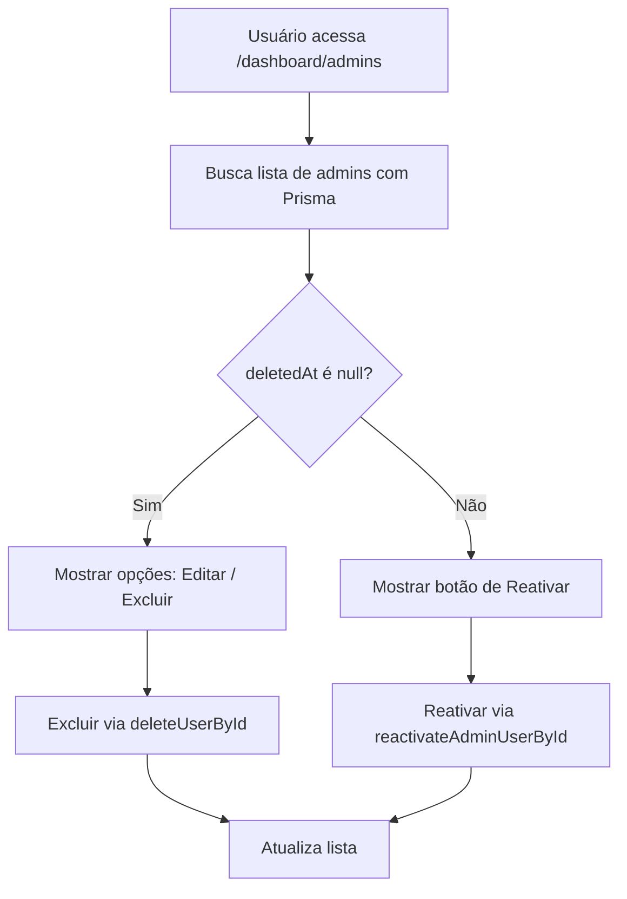
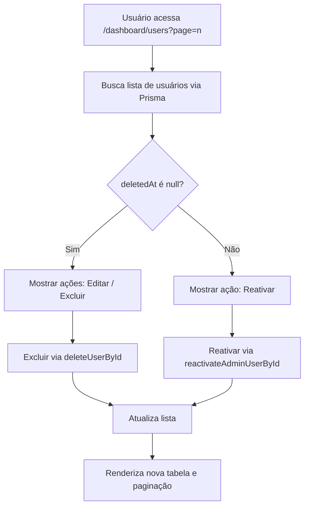
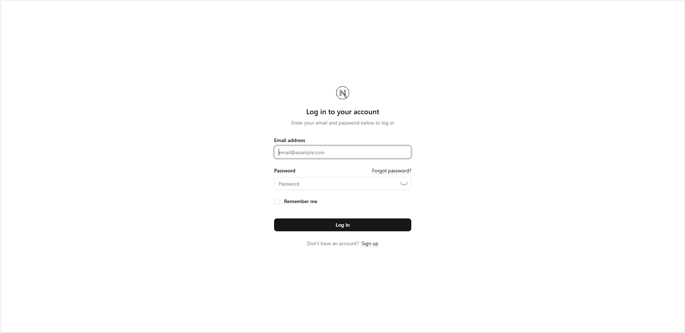
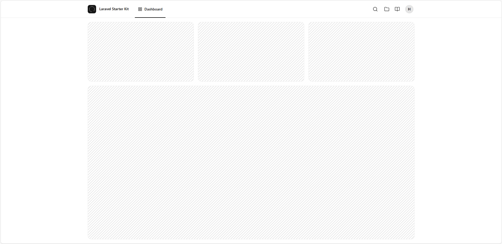
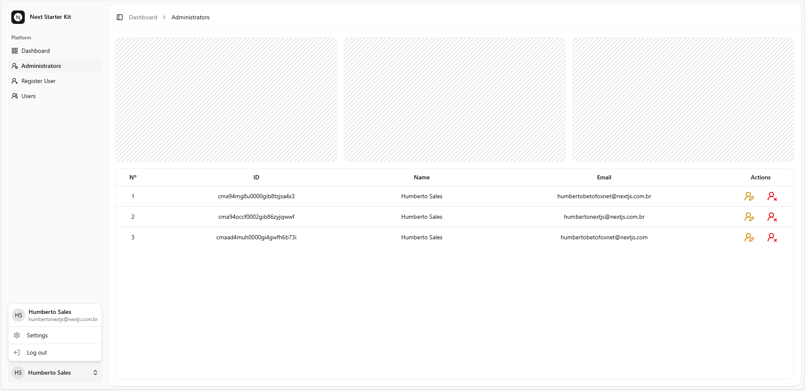
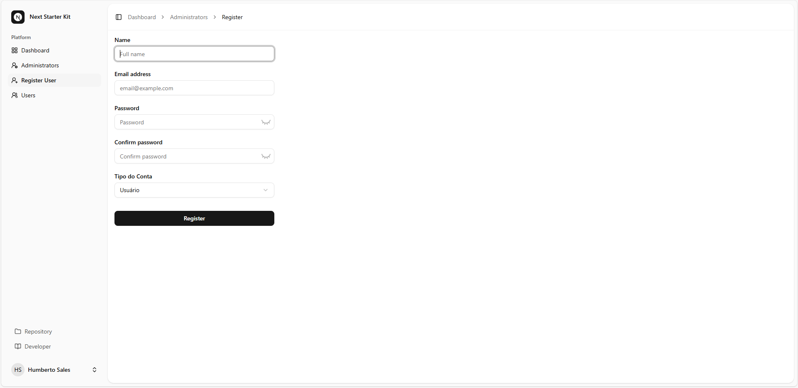
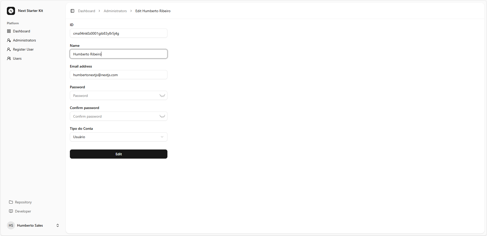

<div align="center">

  <a href="https://betofoxnet-info.vercel.app/"></a>

# BetoFoxNet

  <a href="https://nextjs.org/"></a>

## Sobre NextJS
### Autenticação!

</div>

## 👤 Página de registro do administrador (Next.js + Prisma)
Este projeto inclui uma página de registro de administrador protegida. O formulário é acessível se não houver um usuário administrador no banco de dados o primeiro Usuário criado é com o `role` `"ADMIN"` e os próximos seram `"USER"`.
Ele foi desenvolvido com Next.js App Router, Prisma, bcrypt-ts, React Hooks, shadcn-ui e validação Zod.

## 📁 Estrutura do arquivo

```bash

/app
  /register
    └── page.tsx                # Redireciona se o administrador existir
    └── form-register-admin.tsx # Formulário de registro de administrador do lado do cliente

/app/api/actions
  ├── createadmin.ts            # Lógica do lado do servidor para criação de administrador
  ├── deleteadminuser.ts        # Exclusão lógica de administrador
  └── reactivateadminuser.ts    # Reativação de administrador deletado

/lib
  ├── prisma.ts                 # Cliente Prisma para comunicação com o banco de dados
  ├── session.ts                # Gerenciamento de sessão e autenticação
  ├── definitions.ts            # Definições de tipos e validações Zod
  └── dal.ts                    # Funções auxiliares de acesso a dados (ex: getUser)
```

---

## 🚦 Lógica de redirecionamento (`page.tsx`)

```tsx

const isUserAdmin = await prisma.user.findMany({ where: { role: 'ADMIN' } });
if (isUserAdmin.length > 0) redirect('/dashboard');

```

Se já existir um usuário ADMIN, ele será redirecionado para `/dashboard`.
Caso contrário, o formulário de registro de administrador será exibido.

---

### 🧾 Formulário de registro de administrador

## O formulário inclui os seguintes campos:

- Nome

- E-mail

- Senha

- Confirmação de senha

- Papel (bloqueado para ADMIN)

## A validação inclui:

- Campos obrigatórios

- Valid email format

- Correspondência de senha

- Senha forte (gerenciada pelo Zod)

## Recursos de UX:

- Alternar entre mostrar/ocultar senha

- Mensagens de erro em linha

- Carregando spinner no botão de envio

---

## 🔐 Lógica do lado do servidor (createadmin.ts)

```ts

const hashedPassword = await bcrypt.hash(password, 12);
const user = await prisma.user.create({ data: { name, email, role, password: hashedPassword } });

```

### A função createAdmin:

1. Valida os dados do formulário usando Zod.

2. Gera hash da senha com bcrypt-ts.

3. Cria o usuário no banco de dados usando Prisma.

4. Inicia uma sessão automaticamente.

Em caso de falha, retorna um aviso genérico que é exibido na interface do usuário.

---

## 📋 Como usar

1. Clone este repositório.

2. Configure suas variáveis ​​de ambiente, especialmente DATABASE_URL.

3. Execute as migrações do Prisma:

```bash

npx prisma migrate dev

```

4. Inicie o servidor de desenvolvimento:

```bash

npm run dev

```

5. Acesse `http://localhost:3000`.

Se não houver um administrador, o formulário será exibido. Caso contrário, você será redirecionado.

---

## ✅ Pilha de Tecnologia

- Next.js 15+ (Roteador de Aplicativos)

- TypeScript

- Prisma ORM

- Zod (validação de formulários)

- bcrypt-ts (hash de senhas)

- React Hooks

- Server Actions

- next-intl (internacionalização)

- lucide-react (ícones)

---

## 💡 Observações

- O registro é único: permitido somente se não houver um administrador.

- O campo de função foi corrigido para ADMIN para evitar tipos de usuários arbitrários.

- Todos os textos são localizados usando next-intl para suporte a vários idiomas.

---

## 🧩 Visão geral

Este módulo de login inclui:

- Um componente de servidor (LoginPage) que envolve o formulário de login em um limite Suspense.

- Um componente de cliente (LoginClient) que renderiza o formulário.

- Uma ação de servidor (loginUser) que lida com a autenticação do usuário com segurança no lado do servidor.

---

### 📁 Estrutura do arquivo

```pgsql

/login
 ├── page.tsx                <- Server Component (LoginPage)
 ├── login-client.tsx        <- Client Component (Login)
/api/actions/loginuser.ts    <- Server Action for login

```

---

1. 🧠 LoginPage – Componente do Servidor

```tsx

import { Suspense } from 'react';
import LoginClient from './login-client';
import LoadingLoginSimple from '@/components/loadings/loading-login-simple';

export const metadata = { title: 'Log in' };

export default function LoginPage() {
    return (
        <Suspense fallback={<LoadingLoginSimple />}>
            <LoginClient />
        </Suspense>
    );
}

```

---

# 2. 🧾 LoginClient – ​​Formulário de Login (Componente Cliente)

### Recursos:

- Entradas controladas com useState.

- Mensagens de erro de validação via state.errors.

- Alternância de visibilidade da senha.

- Carregamento de feedback durante o envio.

- Internacionalização via `next-intl`.

- Redirecionamento para `/dashboard` em caso de sucesso.

### Ganchos utilizados:

- useActionState() → Executa loginUser.

- useEffect() → Manipula parâmetros de consulta de URL (como ?status=...).

- useRef() → Para definir o foco da entrada.

- useRouter() → Para redirecionar programaticamente.

### Fluxo:

- O usuário preenche o formulário → o envia.

- Chama a ação do servidor loginUser via useActionState.

- Trata erros de validação, mensagens e redirecionamentos com base no resultado.

---

# 3. 🔐 loginUser – Ação do Servidor

```ts

'use server';

import prisma from '@/lib/prisma';
import { FormStateLoginUser, signInSchema } from '@/lib/definitions';
import { compare } from 'bcrypt-ts';
import { createSession } from '@/lib/session';

export async function loginUser(state: FormStateLoginUser, formData: FormData): Promise<FormStateLoginUser> {
    const validatedFields = signInSchema.safeParse({
        email: formData.get('email') as string,
        password: formData.get('password') as string,
    });

    if (!validatedFields.success) return { errors: validatedFields.error.flatten().fieldErrors, };

    const { email, password } = validatedFields.data;

    try {
        const user = await prisma.user.findFirst({ where: { email, deletedAt: null } });

        if (!user) return { warning: 'E-mail ou senha inválidos' };

        const isPasswordValid = await compare(password, user.password);

        if (!isPasswordValid) return { warning: 'E-mail ou senha inválidos' };

        await createSession(user.id, user.role);

        return { message: 'Autenticação bem-sucedida! Redirecionando para o Painel, aguarde...' };
    } catch (error) {
        console.error('Unknown error occurred:', error);
        return { warning: 'Ocorreu um erro desconhecidoAlgo deu errado. Tente novamente mais tarde.' };
    };
}

```

### Lógica-chave:

- Valida e-mail e senha usando o esquema Zod.

- Encontra o usuário no banco de dados Prisma.

- Compara senhas com hash usando bcrypt-ts.

- Se bem-sucedido, cria uma sessão.

- Retorna erros de validação, avisos ou uma mensagem de sucesso.

---

# ✅ Requisitos

Para que tudo funcione, certifique-se de ter:

- ✅ `zod` para validação (`signInSchema`).

- ✅ `bcrypt-ts` para hash/comparação de senhas.

- ✅ prisma e um modelo User com os campos: `email`, `password`, `deletedAt`.

- ✅ Manipulação de sessão com `createSession(user.id)`.

---

# 🧪 Como Testar

1. Falha no Login: Tente com credenciais inválidas → Você deverá ver um erro.

2. E-mail pré-preenchido: Acesse uma URL como ?email=test@example.com&status=created → O formulário é pré-preenchido e uma mensagem é exibida.

3. Alternar Senha: Clique no ícone de olho para alternar a visibilidade da senha.

4. Esqueceu a Senha: O link aparece somente quando o status não está definido.

5. Sucesso: Em caso de login correto, redireciona para `/dashboard`.

---

# 🛡️ Tutorial: Autenticação JWT com Cookies Somente HTTP no Next.js (App Router)

Este sistema de autenticação utiliza:

- jose para assinatura e verificação JWT

- Cookies Somente HTTP para armazenamento seguro de sessões

- Proxy Next.js para proteção de rotas

- Prisma ORM para buscar dados de usuários autenticados

---

# 🧱 Visão Geral da Estrutura do Projeto

O sistema é dividido em três módulos principais:

1. session.ts – Gerenciamento de sessão: cria, verifica, atualiza e descriptografa JWTs

2. getUser.ts – Recupera o usuário autenticado atual do banco de dados

3. proxy.ts – Protege rotas com base no estado da sessão

---

# 📦 1. session.ts – Gerenciamento de Sessão com JWT

### ⚙️ Configuração Inicial

```ts

import 'server-only';
import { SignJWT, jwtVerify } from 'jose';
import { cookies } from 'next/headers';
import { redirect } from 'next/navigation';

if (!process.env.AUTH_SECRET) throw new Error('SECRET is not defined');
const secretKey = process.env.AUTH_SECRET;
const encodedKey = new TextEncoder().encode(secretKey);

```

- Carrega uma chave secreta do ambiente (`AUTH_SECRET`)

- Esta chave é usada para assinar e verificar JWTs usando o algoritmo `HS256`

---

# 🔒 Configurações de vida útil do token

```ts

const MAX_SESSION_AGE = 24 * 60 * 60;   // 24 horas
const TOKEN_LIFETIME = 15 * 60;        // 15 minutos
const RENEW_THRESHOLD = 5 * 60;        // 5 minutos

```

- TOKEN_LIFETIME: Tempo de vida inicial do JWT

- RENEW_THRESHOLD: Se o tempo restante do JWT for menor que esse, ele será atualizado.

- MAX_SESSION_AGE: Tempo máximo absoluto da sessão (após o qual o usuário deve se autenticar novamente).

---

# 🔐 createSession(userId: string)

Gera um JWT assinado (`válido por 15 minutos`) e o define em um cookie seguro, `somente HTTP`, chamado `sessionAuth`.

```ts

export async function createSession(userId: string): Promise<void> {
    const now = Math.floor(Date.now() / 1000);
    const expTimestamp = now + TOKEN_LIFETIME;
    const expDate = new Date(expTimestamp * 1000);

    const session = await new SignJWT({ userId, role, iat: now })
        .setProtectedHeader({ alg: 'HS256' })
        .setIssuedAt(now)
        .setExpirationTime(expTimestamp)
        .sign(encodedKey);

    (await cookies()).set('sessionAuth', session, {
        httpOnly: true,
        secure: true,
        expires: expDate,
        sameSite: 'lax',
        path: '/'
    });
}

```

## Atributos do cookie:

- `httpOnly`: não acessível via JavaScript (protege contra XSS)

- `secure`: enviado somente via HTTPS

- `sameSite: 'lax'`: atenua CSRF

- `expires`: 15 minutos após a emissão

- `path: '/'`: válido em todo o site

---

# 🔎 decrypt(session: string)

Decodifica e verifica o JWT. Retorna o payload ou `null` se o token for inválido ou expirado.

```ts

export async function decrypt(session: string | undefined = '') {
    if (!session) return null;
    try {
        const { payload } = await jwtVerify(session, encodedKey, { algorithms: ['HS256'] });
        return payload;
    } catch (err) {
        console.log('failed to verify session', err);
        return null;
    }
}

```

- Verifica usando HS256 com o segredo compartilhado

- Lida com tokens inválidos ou ausentes com elegância

---

# ✅ verifySession()

Verifica se existe uma sessão válida. Caso contrário, redireciona o usuário para `/login`.

```ts

export async function verifySession(): Promise<{ isAuth: boolean; userId: string; }> {
    const cookie = (await cookies()).get('sessionAuth')?.value;
    const session = await decrypt(cookie);
    if (!session?.userId) redirect('/login');

    return { isAuth: true, userId: String(session.userId) };
}

```

- Retorna `{ isAuth: true, userId }` se autenticado

- Caso contrário, chama `redirect('/login')`

---

# 🧾 getSession()

Retorna o payload da sessão, se presente e válido, sem acionar um redirecionamento.

```ts

export async function getSession() {
    const session = (await cookies()).get('sessionAuth')?.value;
    if (!session) return null;
    return await decrypt(session);
}

```

- Útil para autenticação opcional ou verificações de antecedentes

---

# 🔄 updateSession()

Renova o cookie de sessão se estiver prestes a expirar e dentro do tempo máximo permitido para a sessão.

```ts

export async function updateSession() {
    const sessionToken = (await cookies()).get('sessionAuth')?.value;

    if (!sessionToken) return null;

    const payload = await decrypt(sessionToken);

    if (!payload?.userId || !payload.exp || !payload.iat) return null;

    const now = Math.floor(Date.now() / 1000);
    const timeLeft = payload.exp - now;
    const sessionAge = now - payload.iat;

    if (sessionAge > MAX_SESSION_AGE) {
        (await cookies()).delete('sessionAuth');
        return null;
    }

    if (timeLeft < RENEW_THRESHOLD) {
        const newExp = now + TOKEN_LIFETIME;
        const newExpDate = new Date(newExp * 1000);

        const newToken = await new SignJWT({ userId: payload.userId, role: payload.role, iat: payload.iat })
            .setProtectedHeader({ alg: 'HS256' })
            .setIssuedAt(payload.iat)
            .setExpirationTime(newExp)
            .sign(encodedKey);

        (await cookies()).set('sessionAuth', newToken, {
            httpOnly: true,
            secure: true,
            expires: newExpDate,
            sameSite: 'lax',
            path: '/'
        });
    }
    return { userId: payload.userId, role: payload.role };
}

```

## Lógica de Renovação:

Verifica quanto tempo resta no token atual (`timeLeft`)

Se `timeLeft < RENEW_THRESHOLD`, cria um novo token sem alterar o `iat` original

Garante que as sessões não possam ser estendidas indefinidamente atualizando dentro de `MAX_SESSION_AGE`

Se `MAX_SESSION_AGE` for excedido, a sessão será excluída e o usuário será desconectado

```ts

{ userId: string, role: string } | null

```

---

# 👤 2. getUser.ts – Obter usuário autenticado

```ts

import 'server-only';
import { cache } from 'react';
import prisma from './prisma';
import { verifySession } from './session';

```

---

# 📥 getUser()

Obtém o usuário no banco de dados usando o ID da sessão.

```ts

export const getUser = cache(async () => {
  const session = await verifySession();
  ...
});

```

- Utiliza Prisma para obter detalhes do usuário

- Encapsulado em cache() para eficiência dos componentes do servidor

---

# 🛡️ 3. proxy.ts – Proteção de Rota com JWT e Acesso Baseado em Função

Este proxy protege rotas com base na presença da sessão e na função do usuário.

## 📄 Código do Proxy (Versão Mais Recente)

```ts

import { NextRequest, NextResponse } from 'next/server';
import { updateSession } from './lib/session';

export default async function proxy(req: NextRequest) {
  const path = req.nextUrl.pathname;

  const isProtectedRoute = path.startsWith('/dashboard');
  const isAdminRoute = path.startsWith('/dashboard/admins');
  const isPublicRoute = ['/login', '/'].includes(path);

  const session = await updateSession();

  if (isProtectedRoute && !session?.userId) {
    return NextResponse.redirect(new URL(`/login?redirect=${encodeURIComponent(path)}`, req.nextUrl));
  }

  if (isPublicRoute && session?.userId && !path.startsWith('/dashboard')) {
    return NextResponse.redirect(new URL('/dashboard', req.nextUrl));
  }

  if (isAdminRoute && session?.role !== 'ADMIN') {
    return NextResponse.redirect(new URL('/dashboard', req.nextUrl));
  }

  return NextResponse.next();
}

export const config = {
  matcher: ['/((?!api|_next/static|_next/image|favicon.ico|sitemap.xml|robots.txt|videos/).*)']
};


```

---

## 🔍 Visão geral do comportamento da rota

| Rota                  | Tipo                             | Condição Comportamental                                                 |
|-----------------------|----------------------------------|-------------------------------------------------------------------------|
| Pública        	      | `/login`, `/`	                   | Redireciona para `/dashboard` se a sessão existir                       |
| Protegida	            | Routes under `/dashboard`	       | Requer sessão válida (`userId`) ou redireciona para login               |
| Somente administrador	| Routes under `/dashboard/admins` | Requer função = `'ADMIN'`, caso contrário redireciona para `/dashboard` |

---

# ⚙️ Proxy Matcher
Esta configuração garante que o proxy seja executado apenas em rotas relevantes, ignorando ativos estáticos e endpoints de API:

```ts

export const config = {
  matcher: [
    '/((?!api|_next/static|_next/image|favicon.ico|sitemap.xml|robots.txt|videos/).*)',
  ],
};

```

- <strong>Exclui</strong>: Rotas de API, ativos estáticos Next.js, mídia e arquivos de SEO

- <strong>Aplica-se a</strong>: Todas as outras páginas (incluindo as dinâmicas)

---

# ✅ Como usar em seu aplicativo

### 1. Variável de ambiente
No seu arquivo .env:

 ```ini

 AUTH_SECRET=your_super_secure_secret_key

```

Use um segredo forte e aleatório

---

### 2. Exemplo de Login

Quando um usuário efetua login com sucesso:

```ts

await createSession(user.id);
redirect('/dashboard');

```

---

### 3. Exemplo de Logout

Para encerrar a sessão:

```ts

(await cookies()).set('sessionAuth', '', { expires: new Date(0) });
redirect('/login');

```

---

### 4. Use getUser() em componentes do servidor

```tsx

import { getUser } from '@/lib/getUser';

export default async function DashboardPage() {
  const user = await getUser();

  return <div>Welcome, {user?.name}</div>;
}

```

---

# 🔐 Notas de Segurança

- O JWT é armazenado em um cookie httpOnly seguro → não acessível ao JS

- Os tokens têm vida curta (15 minutos) e são renovados automaticamente

- A renovação da sessão é tratada de forma transparente no proxy

- Todas as rotas protegidas são verificadas a cada solicitação no lado do servidor

---

# 📌 Resumo

Esta configuração oferece:

- Autenticação segura baseada em sessão com JWT

- Proteção de rota usando proxy

- Gerenciamento de usuários baseado em Prisma

- Renovação automática de sessão

---

## 🚦 Lógica de Exibição e Manipulação de Administradores `(page.tsx)`

O arquivo principal /app/dashboard/admins/page.tsx é responsável por:

1️⃣ Buscar os administradores

- Usa o Prisma ORM para consultar todos os usuários com role: 'ADMIN'.

- Exemplo de query:

```ts

const admins = await prisma.user.findMany({
  where: { role: 'ADMIN' },
  select: { id: true, name: true, email: true, deletedAt: true },
});

```

- O campo deletedAt define se o admin está ativo (null) ou excluído (data de exclusão).

## 2️⃣ Exibir a lista em uma tabela

A tabela é construída com os componentes reutilizáveis do design system (@/components/ui/table).

Cada linha mostra:

- Número (posição na lista)

- ID do admin

- Nome

- E-mail

- Ações disponíveis

## 3️⃣ Ações de cada administrador
🟡 Atualizar administrador

- Se o admin listado for o mesmo usuário logado, o link leva a /dashboard/settings/profile.

- Caso contrário, o link é /dashboard/admins/[id]/update.

- Ícone: ✏️ (UserRoundPen).

🔴 Excluir administrador

- A exclusão é feita via formulário que chama a Server Action deleteUserById.

- Antes de excluir, é exibido um dialogo de confirmação (<Dialog />).

- Exclusão lógica: apenas define deletedAt com a data atual.

🟢 Reativar administrador

- Se o campo deletedAt estiver preenchido, aparece o botão de reativação.

- O botão envia o ID do usuário para a Server Action reactivateAdminUserById.

- Reativa o administrador definindo deletedAt = null.

## 4️⃣ Proteção e contexto do usuário

- A função `getUser()` (de `/lib/dal.ts`) obtém o <strong>usuário logado</strong>.

- O ID do usuário logado (`loggedAdmin`) é comparado com o ID de cada admin listado, garantindo que:

  - O `admin` <strong>não possa excluir a si mesmo</strong>.

  - Ao clicar em editar, é redirecionado para <strong>seu próprio perfil</strong>.

## 💾 Server Actions Utilizadas
`deleteUserById`

- Recebe o userId via formulário.

- Atualiza o campo deletedAt no banco de dados.

- Impede exclusão permanente.

`reactivateAdminUserById`

- Recebe o userId via formulário.

- Define deletedAt = null, reativando o usuário.

## 🎨 Componentes de Interface

Os principais componentes usados na UI vêm de `@/components/ui/`:

- `Button`, `Dialog`, `Icon`, `Table`

- `PlaceholderPattern`: elemento visual para preencher o layout quando não há dados.

- `AdminsBreadcrumb`: exibe a navegação superior da página.

## 🧠 Resumo do Fluxo



## 👥 Gerenciamento de Usuários

Esta página do projeto é responsável por listar, editar, excluir (lógico) e reativar usuários dentro do painel administrativo.
Ela também implementa paginação dinâmica, exibindo os usuários em blocos de 10 por página.

## 📁 Estrutura do Arquivo

```bash

/app/dashboard/admins/users/
  └── page.tsx                     # Página principal de listagem e controle de usuários

/app/api/actions/
  ├── deleteadminuser.ts           # Server Action de exclusão lógica de usuário
  ├── reactivateadminuser.ts       # Server Action para reativar usuários deletados

/components/
  ├── breadcrumbs/users-breadcrumb.tsx  # Componente de navegação para a página de usuários
  ├── ui/
  │   ├── table.tsx                # Tabela reutilizável (UI)
  │   ├── dialog.tsx               # Componente de diálogo de confirmação
  │   ├── pagination.tsx           # Componente de paginação
  │   ├── button.tsx               # Botão customizado
  │   ├── icon.tsx                 # Ícone padronizado
  │   └── placeholder-pattern.tsx  # Padrão visual placeholder
/lib/
  ├── prisma.ts                    # Cliente Prisma
  ├── getvisiblepagination.ts      # Função auxiliar para controlar quais páginas ficam visíveis

```

## 🚦 Lógica da Página /dashboard/users/page.tsx

### 1️⃣ Definição de metadados

```ts

export const generateMetadata = async (): Promise<Metadata> => ({
  title: 'Usuários',
});

```

Define o título da página exibido no navegador e em SEO.

### 2️⃣ Paginação e busca de dados

A constante `pageSize` define o número de usuários por página (neste caso, 10).

```ts

const pageSize = 10;

```

O componente recebe o parâmetro `page` via `searchParams` da URL, calcula a página atual e faz duas consultas paralelas com `Promise.all()`:

- Busca dos usuários da página atual

- Contagem total de usuários

```ts

const [users, totalUsers] = await Promise.all([
  prisma.user.findMany({
    where: { role: 'USER' },
    select: { id: true, name: true, email: true, deletedAt: true },
    skip: (currentPage - 1) * pageSize,
    take: pageSize,
  }),
  prisma.user.count({ where: { role: 'USER' } }),
]);

```

### 3️⃣ Exibição dos usuários em uma tabela

A tabela é renderizada usando componentes reutilizáveis (`Table`, `TableRow`, `TableCell`, etc.) com <strong>TailwindCSS</strong>.
Cada linha exibe:

- Número sequencial (de acordo com a página)

- ID do usuário

- Nome

- E-mail

- Ações possíveis

### 4️⃣ Ações disponíveis por usuário
🟡 Editar Usuário

- Linka para a rota /dashboard/admins/[id]/update (você pode personalizar para /dashboard/users/[id]/update).

- Ícone: ✏️ (UserPen).

🔴 Excluir Usuário

- Exibição de um diálogo de confirmação antes da exclusão.

- A ação de exclusão chama o Server Action deleteUserById via formulário:

```tsx

<form action={deleteUserById}>
    <input type="hidden" name="userId" value={user.id} />
    <Button type="submit" variant="destructive">Sim, Excluir!</Button>
</form>

```

- A exclusão é lógica, ou seja, apenas preenche o campo `deletedAt` no banco de dados (não remove o registro).

🟢 Reativar Usuário

- Se o usuário tiver `deletedAt` definido, exibe um botão de reativação.

- A ação chama `reactivateAdminUserById` (que redefine `deletedAt = null`).

5️⃣ Paginação dinâmica

Abaixo da tabela, é exibida a paginação com botões <strong>Anterior / Próximo</strong> e os números de páginas visíveis, controlados por `getVisiblePagination()`.

```tsx

<Pagination>
  <PaginationContent>
    <PaginationPrevious href={`?page=${currentPage - 1}`} />
    {getVisiblePagination(currentPage, totalPages).map((page) => (
      <PaginationLink key={page} href={`?page=${page}`} isActive={page === currentPage}>
        {page}
      </PaginationLink>
    ))}
    <PaginationNext href={`?page=${currentPage + 1}`} />
  </PaginationContent>
</Pagination>

```

⚙️ O helper `getVisiblePagination()` calcula dinamicamente quais números de página exibir, evitando mostrar todas as páginas quando o total é muito grande.

6️⃣ Placeholder visual

Na parte superior da página há uma grade de placeholders puramente visuais, criados com o componente:

```tsx

<PlaceholderPattern className="absolute inset-0 size-full stroke-neutral-900/20 dark:stroke-neutral-100/20" />

```

Eles preenchem o layout enquanto o conteúdo principal (tabela) é carregado.

## 💾 Server Actions Utilizadas
🧨 deleteUserById

- Marca o usuário como deletado (deletedAt = new Date()).

- É chamada via formulário da UI.

- Evita exclusão física no banco, mantendo rastreabilidade.

🔄 reactivateAdminUserById

- Reativa o usuário, setando deletedAt = null.

- Pode ser chamada pelo botão de reativar em usuários desativados.

## 🧠 Fluxo Resumido



#### Exemplos de troca:

- Para usar o layout do cartão:

```tsx

import AuthLayoutTemplate from '@/components/layouts/auth/auth-card-layout';

```

<div align="center">

  

</div>

---

- Para usar o layout simples:

```tsx

import AuthLayoutTemplate from '@/components/layouts/auth/auth-simple-layout';

```

<div align="center">

  

</div>

---

- Para usar o layout dividido:

```tsx

import AuthLayoutTemplate from '@/components/layouts/auth/auth-split-layout';

```

<div align="center">

  

</div>

---

### ✅ Nada mais precisa ser alterado!

- O componente continuará funcionando normalmente. A alteração afeta apenas a aparência da página de autenticação.

---

### 🔐 Requisitos

- Cada um dos modelos requer:

Aplicar o layout com `children`, `title` e `description`, passando as propriedades corretas para o layout selecionado.

---

### 🧭 Modelos de layout de aplicativos

> **Page:** `/components/layouts/app-layout.tsx`

---

#### Recursos:
- Alteração de modelos para o layout principal do aplicativo (`AppLayout`).
- Suporte à autenticação com `next-auth`: o layout só é renderizado se houver uma sessão ativa.
- Os modelos recebem `user` e `breadcrumbs` como propriedades.
- Os componentes filhos (`children`) são renderizados dentro do layout selecionado.

---

### 📁 Modelos disponíveis

| Modelo                | Descrição                                                                           |
|-----------------------|-------------------------------------------------------------------------------------|
| `app-sidebar-layout`  | Layout com barra lateral de navegação — ideal para painéis e aplicativos complexos. |
| `app-header-layout`   | Layout de cabeçalho fixo na parte superior — mais compacto e direto.                |

---

### 🔁 Como alternar entre modelos

Para alterar o modelo de layout principal do aplicativo, **basta substituir a importação de layout** no arquivo `app-layout.tsx`.

---

#### Exemplos de troca:

- Para usar o layout da barra lateral:

```tsx

import AppLayoutTemplate from '@/components/layouts/app/app-sidebar-layout';

```

<div align="center">

  

</div>

---

- Para usar o layout do cabeçalho:

```tsx

import AppLayoutTemplate from '@/components/layouts/app/app-header-layout';

```

<div align="center">

  

</div>

---

### ✅ Nada mais precisa ser alterado

A estrutura permanece a mesma. O componente `AppLayout` renderiza o layout escolhido com base na importação, passando `user`, `breadcrumbs` e `children`.

---

### 🔒 Administrador de layout

<div align="center">

  

</div>

---

<div align="center">

  

</div>

---

<div align="center">

  

</div>

---

<div align="center">

  

</div>

---

## Instalar pacotes

Versão do Node 20+

Postgres 16+

---

```bash

git clone -b preview-staging https://github.com/HumbertoFox/next-auth-start-kit.git

```

---

```bash

npm install -g npm@11.3.0

```

---

```bash

npm install

```

---

### Variáveis ​​de ambiente

---

```bash

NEXT_URL=
DATABASE_URL=
AUTH_SECRET=
AUTH_URL=
SMTP_HOST=
SMTP_PORT=
SMTP_USER=
SMTP_PASS=

```

---

```bash

npx prisma migrate dev

```

---

### Desenvolvido em:

---

<div>

  
  
  
  
  
  
  
  
  
  
  
  
</div>